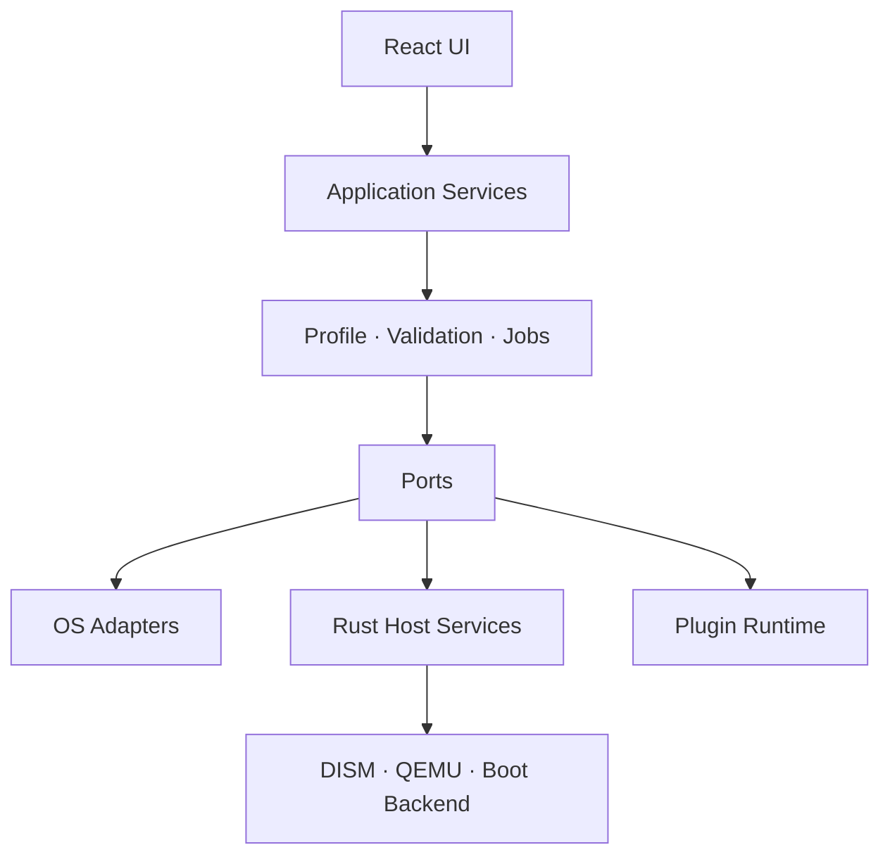

# BootForge Studio – technische Architektur v0.1

## 1. Architekturentscheidung

BootForge Studio wird als modularer Monolith mit Hexagonal Architecture umgesetzt: React/TypeScript bildet die Präsentation, Rust/Tauri die vertrauenswürdige Desktop-Grenze. Kernfälle sprechen nur Ports an. OS-Adapter, Boot- und VM-Backends werden über versionierte Interfaces eingebunden.

Tauri bleibt die bevorzugte Laufzeit: kleinere Angriffsfläche und Binärgröße als Electron, native Prozess-/Dateisystemkontrolle in Rust und ein explizites Command-Rechtemodell. Electron ist für den MVP nicht erforderlich. Die gehostete Oberfläche dient als interaktiv prüfbarer Client; privilegierte Funktionen bleiben in Tauri.

Wesentliche Entscheidungen:

| Thema | Entscheidung | Begründung |
| --- | --- | --- |
| Standardausgabe | Dynamische Konfiguration | Originale ISO unverändert, weniger Speicher, schnellere Updates |
| Kernarchitektur | Ports & Adapter | Austauschbare OS-, Boot-, VM- und Werkzeugadapter |
| Host-Grenze | Rust Commands | Validierte Argumentlisten, Cancellation, atomare Dateien |
| Persistenz | SQLite + WAL | Lokale Transaktionen, Migrationen, nachvollziehbare Jobs |
| Secrets | Separater Vault + OS-Keychain | Keine sensiblen Werte im Profildokument |
| Generierte Dateien | Deterministisch aus Profil | Diffbar, testbar, reproduzierbar |
| Erweiterungen | Manifest + Signatur + Capability-Sandbox | Keine impliziten System-/Netzwerkrechte |

## 2. Komponentenübersicht



- **ISO Analyzer:** streamt Prüfsumme, liest Dateisystem/Bootkatalog, führt signierte Detektionsregeln aus.
- **Profile Engine:** Schema, Migration, Vererbung, Diff/Merge, revisionssicherer Export ohne Secrets.
- **OS Adapter Registry:** Windows/Ubuntu im MVP; Debian/Fedora/Arch zunächst Detection + Capability-Anzeige.
- **Build Orchestrator:** unveränderlicher Build-Plan, Preflight, Cancellation, resumierbare Schritte, Artefaktmanifest.
- **Device Service:** blockiert System-/interne Laufwerke, verlangt gerätegebundene Bestätigung.
- **Boot Backend:** Ventoy extern oder spätere GRUB/systemd-boot-Adapter.
- **VM Backend:** QEMU zuerst; erzeugt nur Argumentlisten, niemals Shell-Strings.
- **Audit Logger:** strukturierte, secret-bereinigte Ereignisse pro Job-ID.

## 3. Verzeichnisstruktur

```text
bootforge-studio/
├── app/                    # Client-Einstieg und globale Styles
├── components/             # UI-Shell und funktionsbezogene Views
├── src/
│   ├── core/               # Reine Domänenlogik, Schemas, Adapterports
│   └── data/               # Editierbare Beispiel-/Seed-Daten
├── src-tauri/
│   └── src/                # Privilegierte Host-Services und Commands
├── docs/                   # Architektur, Schema, Sicherheit, Roadmap
├── tests/core/             # Vitest-Kerntests
└── .openai/                # Hostingidentität der interaktiven Oberfläche
```

Zielstruktur für die nächste Phase: `crates/{domain,application,infrastructure,plugin-sdk}` und UI-Featureordner pro Hauptbereich. Das MVP hält die Zahl der Dateien klein, ohne die fachlichen Grenzen zu vermischen.

## 4. Datenmodell und SQLite

Die vollständige Startmigration steht in `docs/schema.sql`.

| Aggregat | Wichtige Felder | Regeln |
| --- | --- | --- |
| `iso_images` | sha256, family, version, architecture, confidence | SHA-256 eindeutig; Original nie überschreiben |
| `profiles` | schema_version, family, current_revision_id | Profilinhalt ohne Secrets |
| `profile_revisions` | content_json, parent_revision_id, created_at | Unveränderlich, diffbar |
| `secret_refs` | profile_id, key, vault_locator | Nur Locator, niemals Secretwert |
| `devices` | serial, removable, system_disk, last_seen | Systemdatenträger gesperrt |
| `jobs` / `job_steps` | state, progress, tool_versions, redacted_payload | Zustandsautomat, resumierbare Grenzen |
| `artifacts` | sha256, type, source_job_id | Atomar geschrieben, Herkunft belegt |
| `plugins` | manifest, signature_status, permissions | Standardmäßig deaktiviert |

## 5. Profilschema

Das kanonische Transportformat ist JSON; YAML ist eine alternative Darstellung derselben Daten. `schemaVersion` liegt an der Wurzel und wird vor der Validierung migriert. Normale Exporte enthalten ausschließlich `vault://...`-Referenzen.

```json
{
  "schemaVersion": 1,
  "id": "dev",
  "name": "Windows 11 Development",
  "imageId": "win11",
  "family": "windows",
  "outputMode": "dynamic",
  "identity": {
    "hostname": "dev-pc",
    "timezone": "W. Europe Standard Time",
    "locale": "de-DE",
    "keyboard": "de-DE"
  },
  "users": [{
    "username": "developer",
    "role": "administrator",
    "accountType": "local",
    "passwordMode": "prompt_at_install"
  }],
  "storage": { "mode": "guided", "partitionTable": "gpt", "preserveDataPartitions": false, "encryption": "none" },
  "software": [{ "source": "winget", "id": "Git.Git" }]
}
```

Synchronisation der Expertenansicht: Im MVP ist generierter Text schreibgeschützt. Später erhält jede Datei einen expliziten Modus `generated` oder `detached`; beim Ablösen wird eine Kopie mit Basisrevision gespeichert. Regeneration überschreibt nur `generated`.

## 6. Sicherheitsmodell

Vertrauenszonen:

1. **Untrusted input:** ISO, INF, Skripte, Profile, Pluginpakete.
2. **Validated domain:** normalisierte Metadaten und Profile ohne Secrets.
3. **Privileged host:** Gerätezugriff, Mounts, DISM, QEMU, Boot-Backend.
4. **Vault:** separat verschlüsselte Werte; Ausgabe nur für einen konkreten Job und kurze Lebensdauer.

Kontrollen:

- Kein Command nimmt einen zusammengesetzten Shell-String an; Executable und Argumente sind getrennt.
- Gerät vor Planerstellung und unmittelbar vor dem ersten Schreibzugriff erneut identifizieren.
- Systemlaufwerk und nicht entfernbare Ziele hart blockieren; Expertenmodus hebt das im MVP nicht auf.
- Bestätigung enthält Modell und Seriennummer; keine destruktive Option vorausgewählt.
- Temporäre Verzeichnisse pro Job mit restriktiven Rechten, Cleanup-Wächter und verwaister-Job-Recovery.
- XML/YAML/JSON strukturiert erzeugen; Nutzereingaben werden escaped/validiert.
- Secrets werden vor Persistenz und Logging über Feldklassifizierung entfernt; Logmaskierung ist zusätzliche Defense-in-Depth.
- Signierte Regelupdates mit Rollback-Schutz; neue OS-Versionen laufen zunächst im konservativen Unknown-Modus.
- Plugins deklarieren Dateisystem-, Prozess- und Netzwerkfähigkeiten; Signatur und API-Kompatibilität werden vor Aktivierung geprüft.

Primäre Bedrohungen: falsches Zielgerät, Command Injection, manipulierte ISO, schädliches Script/Plugin, Secret-Leak in Logs, TOCTOU bei Wechseldatenträgern und unvollständige Mount-Cleanup-Vorgänge.

## 7. UI-Seiten und Benutzerflüsse

Hauptseiten: Dashboard, ISO-Bibliothek, Installationsprofile, Multi-Boot-Sticks, ISO-Builder, Treiber & Pakete, Skripte, Virtuelle Tests, Logs, Einstellungen.

**Einsteigerfluss:** Verwendungszweck → Kontotyp → Speicherstrategie → Softwareauswahl → verständliche Zusammenfassung → Preflight → VM-Test → dynamische Ausgabe.

**Expertenfluss:** ISO wählen → Adapterfähigkeiten prüfen → alle Profilbereiche konfigurieren → erzeugte XML/YAML/Skripte lesen → Diff/Build-Plan → Warnungen quittieren → reproduzierbaren Job starten.

**ISO-Import:** Datei → gestreamte SHA-256 → Struktur/Bootmodi → OS/Edition/Architektur → Vertrauen → Automatisierungsmöglichkeiten → Profilvorlage.

**Destruktiver USB-Fluss:** Gerätedetails → interner Schutzcheck → Partitions-Diff → Backupangebot → Bestätigungstext → letzter Geräte-Identitätscheck → Job mit klarer Abbruchgrenze.

## 8. MVP-Abgrenzung

Im MVP real: Schemavalidierung, Profilpersistenz/-migration, Detektionsregeln, Windows-/Ubuntu-Generatoren, Preflight, USB-Sicherheitsregeln, Jobmodell, Adapterports und Konfigurationsexport.

Als explizite Mock-Adapter: Ventoy-Ausführung, USB-Partitionierung, ISO-Mount/Neuaufbau, QEMU-Prozessstart, WIM-/ESD-Servicing und OS-Keychain. Kein Mock behauptet, ein Medium geschrieben oder eine VM tatsächlich gestartet zu haben.

Nicht im MVP: eigener Bootloader, Secure-Boot-PKI, PXE, Flottenverwaltung, Cloud-Sync, automatische Treiberdownloads und plattformübergreifend vollständiges WIM-Mounting.

## 9. Technische Risiken

| Risiko | Wirkung | Gegenmaßnahme |
| --- | --- | --- |
| USB-Gerät ändert sich zwischen Check und Write | Datenverlust | Seriennummer/Device-ID direkt vor Write erneut prüfen |
| Windows ISO-/OOBE-Strukturen ändern sich | fehlerhafte Installation | signierte Kompatibilitätsregeln, Unknown-safe Default |
| Boot-Backend-Lizenzkopplung | Compliance-Verstoß | externe Prozessgrenze, getrennte Distribution, Lizenzinventar |
| WIM-Mount bleibt verwaist | Hostzustand beschädigt | Mount-Journal, finally-Cleanup, Repair-Command |
| Skript-/Paketquelle kompromittiert | Codeausführung | Prüfsummen, Signaturen, keine ungeprüften Autocommands |
| Tauri Capability zu breit | Privilege Escalation | minimale Commands, allowlist pro Fenster, kein generischer Shell-Port |
| VM-Test liefert falsches Positiv | fehlerhaftes Medium | Meilenstein-Erkennung + Logs + Screenshot, nicht nur Exitcode |

## 10. Entwicklungsreihenfolge

1. Schema, SQLite-Migrationen, Domain-IDs und Fehlercodes stabilisieren.
2. Rust-ISO-Reader mit Fixtures/Golden Files und gestreamter SHA-256 implementieren.
3. Profil-Repository, Revisionen, Import/Export und Vault-Referenzen anbinden.
4. Windows-/Ubuntu-Adapter gegen reale Installationsfixtures härten.
5. Preflight als zentrale Policy-Pipeline und Build-Zustandsautomat fertigstellen.
6. Geräteinventar und USB-Schutz unter Windows/Linux mit Integrationstests umsetzen.
7. Externes Ventoy-Backend hinter der gemeinsamen Schnittstelle integrieren und lizenzieren.
8. QEMU-Backend mit UEFI/TPM/Snapshot und Testbericht implementieren.
9. ISO-Rebuild-Werkzeugadapter, atomare Artefakte und reproduzierbares Manifest ergänzen.
10. Plugin-SDK, Signaturkette, Sandbox und Kompatibilitätsregelupdates öffnen.

Nach jedem Schritt bleiben UI, Tests und Build lauffähig; reale Adapter ersetzen genau einen sichtbaren Mockstatus.
